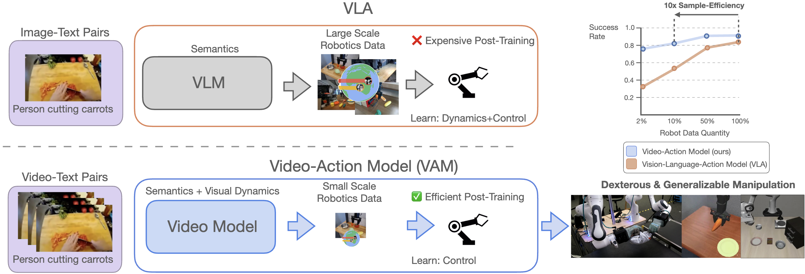

# mimic-video: Video-Action Models for Generalizable Robot Control Beyond VLAs

<p align="center">
    <a href="https://arxiv.org/abs/2512.15692"><strong>Paper</strong></a>
    &nbsp;·&nbsp;
    <a href="https://mimic-video.github.io"><strong>Website</strong></a>
    &nbsp;·&nbsp;
    <a href="https://huggingface.co/jonpai/mimic-video"><strong>Checkpoints</strong></a>
</p>

## Introduction

<p align="center">
    
</p>

mimic-video extracts generalist language-conditioned robot policies (Video-Action Models / VAMs) from pretrained video models by conditioning small action decoders on the video backbones' latent representations. By drawing on the video model's knowledge of real-world dynamics and behaviors, performant action decoders can be learned efficiently and without updating the video model. Employing decoupled flow times for video and for actions, efficient inference can be performed with a single video model forward pass per action chunk.

We instantiate our approach with the lightweight 2B Cosmos-Predict2 video model and release trained checkpoints for Bridge and LIBERO.

## Repository Overview

We provide our data ([DATA.md](DATA.md)), modeling ([MODEL.md](MODEL.md)), and evaluation ([EVAL.md](EVAL.md)) code. See the respective markdowns for details.

```
mimic-video
├── data_preprocessing  # data preprocessing
├── eval                # evaluation
└── model               # dataloading, model architecture, training, and inference
```

## Environment Setup and Downloading Checkpoints

1. Create uv environment.
```bash
curl -LsSf https://astral.sh/uv/install.sh | sh
cd model
uv sync --extra cu126
source .venv/bin/activate
```

2. (Optional) Download trained bridge or libero checkpoints.
```bash
hf auth login

python scripts/download_checkpoints.py
```
If you want to run guardrails (default enabled), additionally request access to and download `nvidia/Cosmos-Guardrail1` and `meta-llama/Llama-Guard-3-8B` to the checkpoints directory.

## Training

You can find an overview over the training repository (which is built on the [Cosmos-Predict2](https://github.com/nvidia-cosmos/cosmos-predict2) repo) in [MODEL.md](./MODEL.md). A quickstart to training your own models is given below.

Multi-node & multi-gpu configuration is handled through [torchrun](https://docs.pytorch.org/docs/stable/elastic/run.html).

### Video Model Finetuning

This assumes you have downloaded at least the text encoder, video tokenizer, and `v2w_pretrained_cosmos`.

1. Extract videos and language instructions.
   1. Choose a `/path/to/dataset/`.
   2. Populate `/path/to/dataset/video/` with `ep.mp4` and `/path/to/dataset/metas/` with `ep.txt` files. Example scripts for bridge and libero are provided in [data_preprocessing/video](./data_preprocessing/video/).
2. Precompute language embeddings in `/path/to/dataset/t5_xxl/`.
```bash
cd data_preprocessing/video/
python get_t5_embeddings.py --dataset_path /path/to/dataset/
```
3. Create video finetuning config.
   1. Add your dataset to `train_datasets` in [data_video.py](./model/cosmos_predict2/configs/defaults/data_video.py) (line 24).
   2. Add your experiment hyperparameters to [video2world.py](./model/cosmos_predict2/configs/experiment/video2world.py).
4. Start training with [torchrun](https://docs.pytorch.org/docs/stable/elastic/run.html). The experiment name is defined in [video2world.py](./model/cosmos_predict2/configs/experiment/video2world.py) from the step before.
```bash
torchrun -m scripts.train --config=cosmos_predict2/configs/config.py -- experiment=...
```

### Action Decoder Pretraining

This assumes you have downloaded the text encoder, video tokenizer, and the video backbone you would like to train an action decoder for.

#### Bridge

1. Download raw data and unzip.
```bash
aria2c -x 16 -s 16 -c "https://rail.eecs.berkeley.edu/datasets/bridge_release/data/demos_8_17.zip"
7z x demos_8_17.zip -obridge/
# todo: maybe untar that one file? still don't know what it is. have to look inside.
```
2. Convert to zarr.
```bash
cd data_preprocessing/action/
python process_bridge.py --raw-dir ../../bridge/raw --output-dir /path/to/data/bridge/
```
3. Precompute language embeddings.
```bash
python precompute_t5.py --dataset-path /path/to/data/bridge/
```
1. Create training config.
   1. Adapt dataset.data_dir in [bridge.yaml](./model/cosmos_predict2/configs/dataloading/dataset/bridge.yaml) to point to the directory containing the data you want to train on. See [DATA.md](./DATA.md) for details on the data config structure.
   2. Choose training hyperparameters (cross-attention layer, learning rate, batch size) and the video model checkpoint in [experiment/world2action.py](./model/cosmos_predict2/configs/experiment/world2action.py). To use the same hyperparameters as the pretrained checkpoints you can select the correct configuration via the experiment name without changing code.
2. Start training with [torchrun](https://docs.pytorch.org/docs/stable/elastic/run.html). The experiment name is defined in [world2action.py](./model/cosmos_predict2/configs/experiment/world2action.py) from the step before.
```bash
cd ../../model
torchrun -m scripts.train --config=cosmos_predict2/configs/config.py -- experiment=...
```

#### LIBERO

1. Follow the [LIBERO dependency installation](#install-dependencies-1) steps.
2. Download the official datasets.
```bash
cd LIBERO
python benchmark_scripts/download_libero_datasets.py --use-huggingface
```
3. Regenerate h5 recordings (filter success, filter no-op, rotate image, re-render at higher resolution).
```bash
cd ../../../data_preprocessing/action/
PYTHONPATH=../../eval/libero/LIBERO/ python regenerate_libero.py --in-dir /path/to/libero/datasets/ --out-dir /path/to/libero/regenerated_datasets/
```
4. Convert to zarr.
```bash
python process_libero.py --input-dir /path/to/libero/regenerated_datasets/ --output-dir /path/to/data/
```
5. Precompute language embeddings.
```bash
python precompute_t5.py --dataset-path /path/to/data/libero_*
```
6. Create training config.
   1. Adapt dataset.data_dir in [libero.yaml](./model/cosmos_predict2/configs/dataloading/dataset/libero.yaml) to point to the directory containing the data you want to train on. See [DATA.md](./DATA.md) for details on the data config structure. If you want to train on different LIBERO subsets, you might want to set it from the top level of the [data config](./model/cosmos_predict2/configs/dataloading/libero.yaml) (and have several of those).
   2. Choose training hyperparameters (cross-attention layer, learning rate, batch size) and the video model checkpoint in [experiment/world2action.py](./model/cosmos_predict2/configs/experiment/world2action.py). To use the same hyperparameters as the pretrained checkpoints you can select the correct configuration via the experiment name without changing code.
7. Start training with [torchrun](https://docs.pytorch.org/docs/stable/elastic/run.html). The experiment name is defined in [world2action.py](./model/cosmos_predict2/configs/experiment/world2action.py) from the step before.
```bash
cd ../../model
torchrun -m scripts.train --config=cosmos_predict2/configs/config.py -- experiment=...
```

## Evaluation

We have integrated [vanilla SIMPLER-Bridge](./eval/bridge/SimplerEnv/simpler_env/main_inference.py), [human-in-the-loop SIMPLER-Bridge](./eval/bridge/SimplerEnv/simpler_env/main_inference_hil.py) (for ground-truth future video generation), and [vanilla LIBERO](./eval/libero/run.py) evals in this repo. To reproduce the sim results with our checkpoints, follow these quick steps:

### SIMPLER Bridge

#### Install dependencies

```bash
sudo apt install libvulkan1

cd eval/bridge

uv pip install -r SimplerEnv/requirements.txt
uv pip install -e SimplerEnv/ManiSkill2_real2sim
uv pip install -e SimplerEnv
```

#### Run evaluation

This assumes you have the checkpoints from [Environment Setup and Downloading Checkpoints](#environment-setup-and-downloading-checkpoints).

##### Normal policy eval

```bash
# Adapt the `GPUS` list (line 1) to which GPUs to parallelize over (now: 0-7).
# Adapt line 8 for how many evals can run in parallel per GPU (now: 2).
# Fill in `checkpoint_dir` with the path to the checkpoint directory (line 33).
bash eval.sh
```

##### Human-in-the-loop evaluation (oracle study)

For this one, you have to sit down and teleop. The policy will get the ground-truth future video from the teleop, add noise, and then decode actions.

```bash
# Fill in `checkpoint_dir` with the path to the checkpoint directory (line 1).
bash eval_hil.sh
```

### LIBERO

#### Install dependencies

```bash
cd eval/libero

uv pip install -r LIBERO/requirements.txt
uv pip install -e LIBERO
```

#### Run evaluation

This also assumes you have the checkpoints from [Environment Setup and Downloading Checkpoints](#environment-setup-and-downloading-checkpoints).

```bash
# Adapt the `GPUS` list (line 1) to which GPUs to parallelize over (now: 0-7).
# Adapt line 8 for how many evals can run in parallel per GPU (now: 2).
# Fill in `checkpoint_dir` with the path to the checkpoint directory (line 29).
bash eval.sh
```

# License

```
Copyright 2026 mimic-video authors and mimic robotics AG

Licensed under the Apache License, Version 2.0 (the "License");
you may not use this repository except in compliance with the License.
You may obtain a copy of the License at

      http://www.apache.org/licenses/LICENSE-2.0

Unless required by applicable law or agreed to in writing, software
distributed under the License is distributed on an "AS IS" BASIS,
WITHOUT WARRANTIES OR CONDITIONS OF ANY KIND, either express or implied.
See the License for the specific language governing permissions and
limitations under the License.
```

# BibTeX

```bibtex
@misc{pai2025mimicvideo,
      title={mimic-video: Video-Action Models for Generalizable Robot Control Beyond VLAs}, 
      author={Jonas Pai and Liam Achenbach and Victoriano Montesinos and Benedek Forrai and Oier Mees and Elvis Nava},
      year={2025},
      eprint={2512.15692},
      archivePrefix={arXiv},
      primaryClass={cs.RO},
      url={https://arxiv.org/abs/2512.15692}, 
}
```
